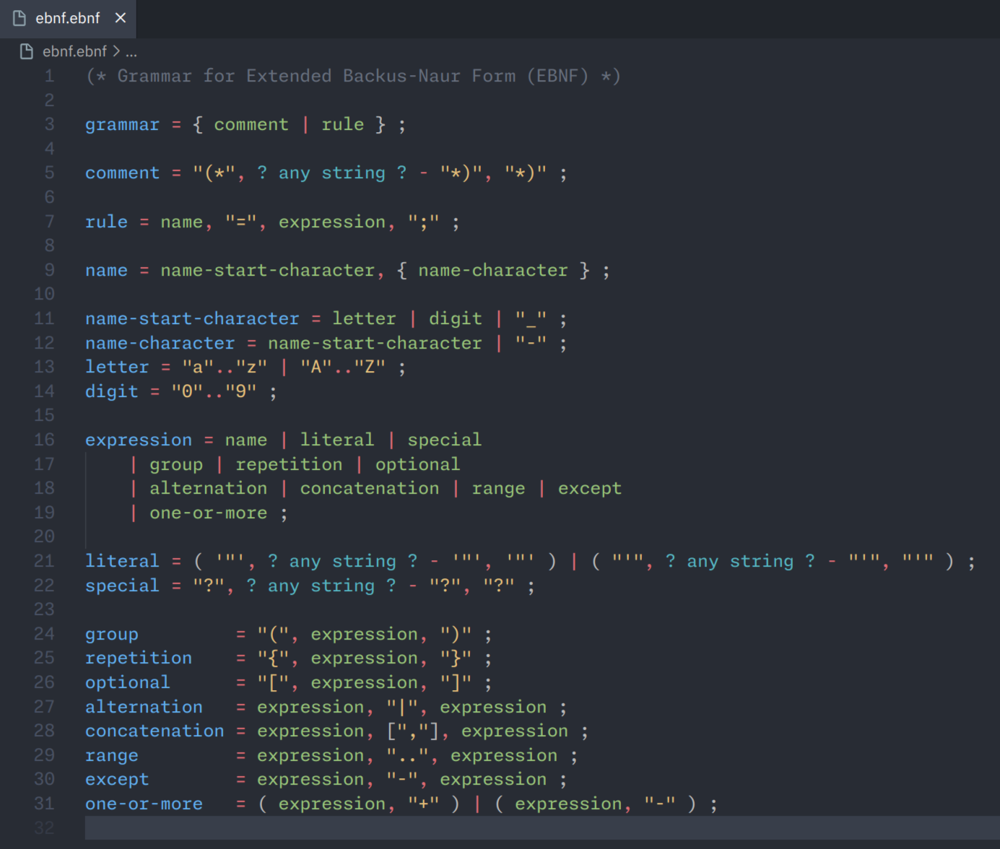

# EBNF Language Support

This extension adds support for an EBNF-like syntax ([Extended Backus-Naur Form](https://en.wikipedia.org/wiki/Extended_Backus%E2%80%93Naur_form)) to Visual Studio Code.



## Table of Contents

- [EBNF Language Support](#ebnf-language-support)
  - [Table of Contents](#table-of-contents)
  - [Features](#features)
  - [Roadmap](#roadmap)
  - [EBNF Syntax](#ebnf-syntax)
  - [Rules](#rules)
    - [Rule Names](#rule-names)
    - [Expressions](#expressions)
      - [Literals](#literals)
      - [Special Cases](#special-cases)
      - [Groups](#groups)
      - [Ranges](#ranges)
    - [Operators](#operators)
      - [Concatenation](#concatenation)
      - [Alternation](#alternation)
      - [Exclusion](#exclusion)


## Features

* Syntax highlighting + semantic highlighting
* Basic error checking
  * Syntax errors
  * Undefined symbols
  * Duplicate symbols
* Go to definition
* Find all references
* Document symbols (go to symbol, outline)
* Basic code completion
  * Rule names
* Hover information
  * Rule name and definition
* Code folding

## Roadmap

* Railroad diagram generation

## EBNF Syntax

This extension implements a simple and strict-ish version of EBNF. The syntax is defined in itself in [ebnf.ebnf](./ebnf.ebnf). 

## Rules

Rules are defined using the assignment operator `=`. The left-hand side is the rule name, and the right-hand side is an *expression*. Rules must end with a semicolon `;`.

### Rule Names

Rule names can start with any letter, number, or an underscore. They can also contain a hyphen, but not at the beginning. Rule names are case-sensitive.

### Expressions

Expressions are made up of *terms* and *operators*. Terms are either literals, references to other rules (by name), special cases, groups, or ranges. Operators are used to combine terms into more complex expressions.

#### Literals

Literals are enclosed in single quotes or double quotes. They can contain any character except for the quote character used to enclose them. No escaping is considered, so you can't use a single quote inside a single-quoted literal, or a double quote inside a double-quoted literal. How to interpret sequences like `\n` is up to the reader. Both literals and special cases can be multiline.

#### Special Cases

Special cases are used to describe content that cannot be easily expressed using the other terms. They are enclosed in question marks `?`, and can have multiple lines.

```ebnf
? any character ?
? valid UTF-8 ?
```

#### Groups

There are three different types of groups: 

* Parentheses (*group*) are only used to group terms together.
* Brackets (*optional*) indicate that the content inside is optional, i.e. it can appear zero or one times.
* Braces (*repetition*) indicate that the content inside can appear zero or more times.

#### Ranges

Ranges are used to define a set a contiguous characters.  They are composed of two strings joined by two dots `..`.

Ranges have no specific definition of what a range "is". It should be obvious what the range should represent. For example, a range of `"A".."Z"` is probably a set of uppercase letters, while a range of `"0".."9"` is probably a set of digits.

### Operators

#### Concatenation

Concatenation can be defined using the comma `,` operator between terms or by juxtaposition of terms.

It does not define what whitespace is allowed between terms; it is assumed that the reader knows what is and isn't allowed.

```ebnf
"A", "B", "C" (* probably "ABC" *)
"fn" name "()" (* probably "fn foo()" *)
```

#### Alternation

The alternation operator is the pipe `|`. It is used to define a set of possible choices for a term.

```ebnf
"A" | "B" | "C" (* "A", "B", or "C" *)
"A", ( "B" | "C" ) (* "AB" or "AC" *)
```

#### Exclusion

The exclusion operator is the caret `-`. It is used to define a set of possible choices for a term, but excludes one or more of them.

```ebnf
letter = "A".."Z" ;
not_z = letter - "Z" ; (* "A".."Y" *)
```
